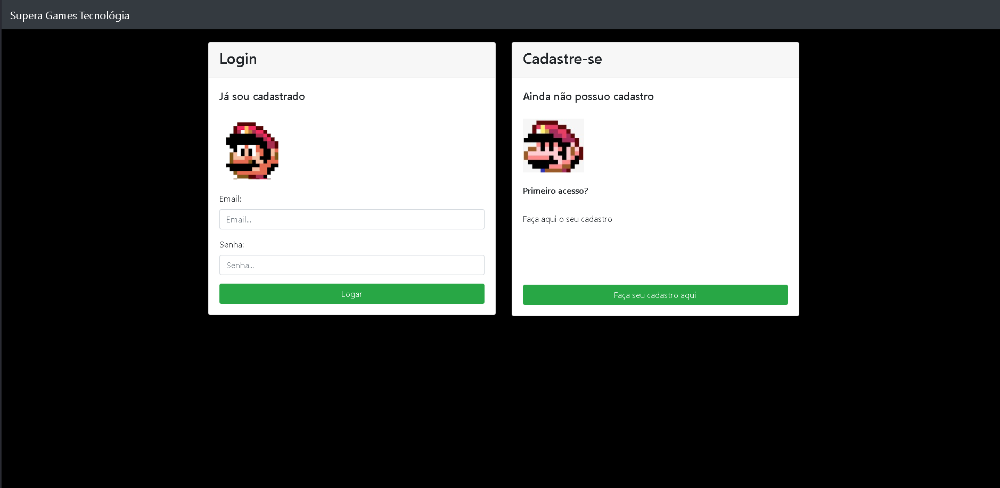
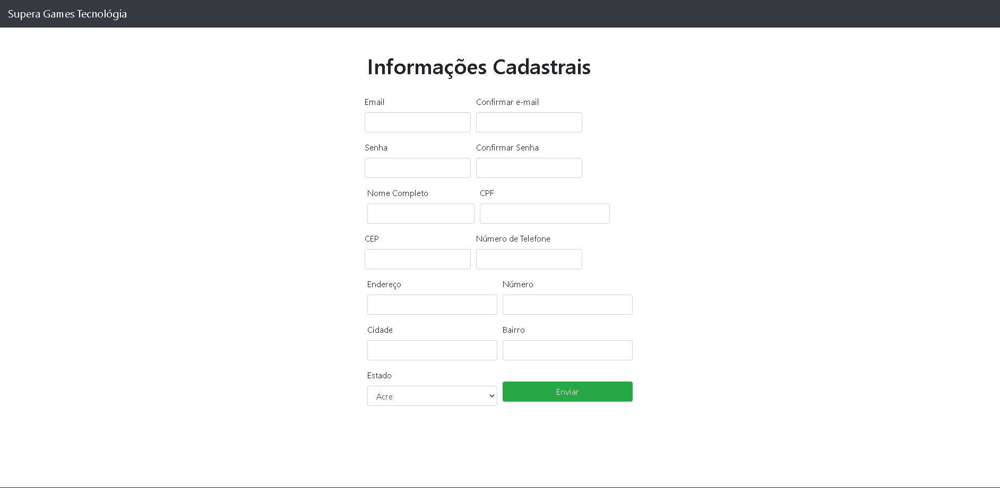
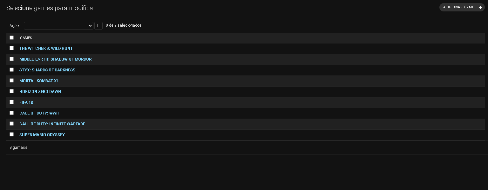
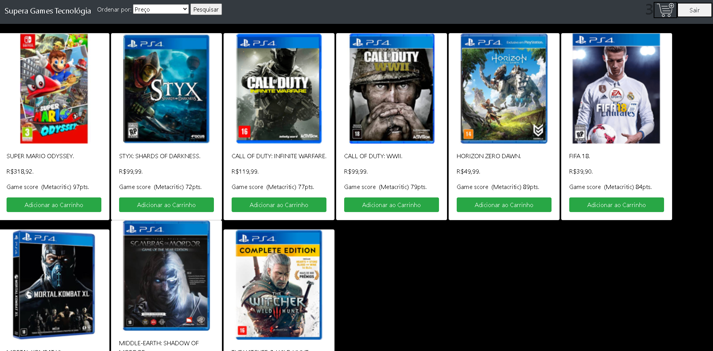
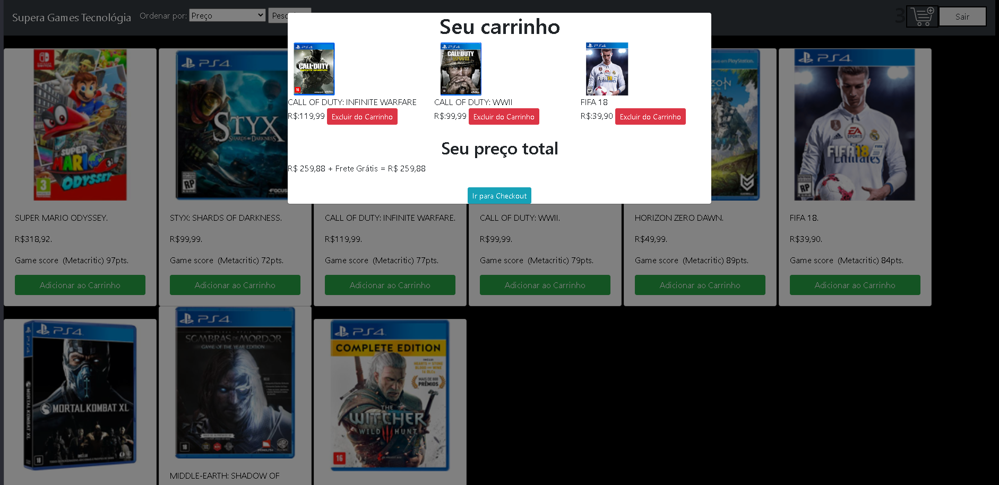
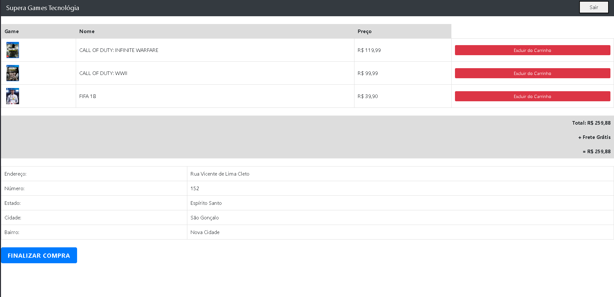
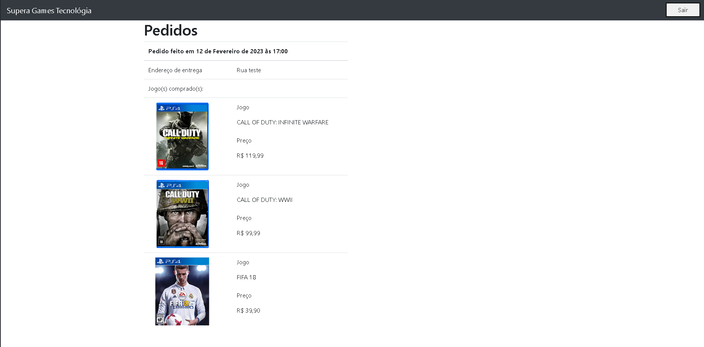

<h1> O Projeto: </h1>

Esse projeto foi feito para construir uma API HTTP de um pseudo e-commerce de games utilizando Python e o framework Django. 

 

O projeto(ecommerce_games) possuí duas aplicações:

usuários: 

- Onde será focado apenas no usuário(login, cadastro e suas validações).

plataforma: 

- Onde será o site de vendas para o usuário onde ele só poderá acessar caso faça login.

- Será onde somente o adminstrador do site(feito isso no django admin)que poderá adicionar os jogos no catalógo de jogo para vender no site(na página administrativa do Django, crie um carrinho vinculado ao seu super usuario caso queira testar o site, pois senão dará um erro)

- Cada jogo adcionado fará com que sua foto fique armazenada no /media

- Deixei uma pasta chamada: capa_games, que está com as fotos dos games no exemplo do preview ao final do documento

- A pasta site são foto e icones que o projeto precisa

- O usuário poderá adicionar apenas um jogo de cada tipo, ou seja, apenas um jogo Mario odyssey ao invés de dois jogos iguais, mas podera adicionar outros jogos que não sejam iguais assim sendo mais de um item no carrinho

- Tendo escolhido os jogos o usuário poderia ver o número do itens ao lado do icone do carrinho

- Ao clicar no carrinho, o usuário poder ver os jogos escolhidos(e remover jogos) e observar o valor total com o frete(caso esteja frete grátis não será acresentado no valor final) e também poderá ir página de checkout

- No checkout o usuário poderá também remover jogos da lista e conferir novamente o preço e tudo dando certo no checkout o usuário será redirecionado para a página de pedidos feitos e as informações do endereço(que foram salvados na página de cadastro) 

 

<h2>1 - Requisitos: </h2>

Instale Python, Django e biblioteca Pillow(processamento de imagem):

- pip install python

- pip install django

- pip install pillow

- pip install psycopg2

ou 

- pip install python django pillow psycopg2

ou 

- instale todas as dependências no requirements.txt

 

<h2>1-1 Pequena observação:</h2>

Criei um email apenas para o projeto, para quando for a verificação de conta do usuário. deixei as pré-configurações no settings.py, na linha 142 até 146.Como esse email criado usei a senha gerada pelo gmail para usar na aplicação do django

E a conexão com banco de dados Postgres que foi feito nas linhas 68 até 76

 

<h2>2 - Primeiros passos:</h2>

Para criar as migrações:

- python manage.py makemigrations

e para migrar ao banco de dados:

- python manage.py migrate

Como o projeto foi feito no django, o primeiro comando para inicializar o servidor será (Windows): 

- python manage.py runserver

com esse comando assim que o servidor começar a funcionar o endereço principal:http://127.0.0.1:8000/ redirecionará para:

 
http://127.0.0.1:8000/acesso/login/ (Caso usuário não esteja logado) ou para

 

http://127.0.0.1:8000/plataforma/home/ (Caso esteja logado)

 

<h2>3 Models: </h2>

<h3>Models do app usuário:</h3>

1 - Existe uma função: generate_token, que é justamente para criar o token de verificação

2 - A class Usuario vai herdar da class AbstractUser, e nela terá campos:

- Email
- Senha
- Nome Completo
- CPF
- Telefone
- Cep
- Endereço
- Número da casa
- Cidade
- Estado(que será um choices de uma lista com todos os estados brasilieros)
- Confirmation token(usado para validação)

<h3>Models do app plataforma:</h3>

1 - A class Games vai ser onde os dados dos jogos adicionados ao site será listados

2 - A class Carrinho criará um vinculo entre usuário e os futuros itens adicionados

3 - A class ItemCarrinho adcionaria os itens ao carrinho, e remover itens, tudo isso para dar ao usuário a escolha no final

4 - E a class Pedido onde ficará cada pedido feito anteriormente, com a data do pedido e os jogos listados

<h2>4 - Endpoints:</h2>

obs: sempre que irei falar o endpoint eu irei abreviar a rota de: http://127.0.0.1:8000/acesso/login/ 
 
para: /acesso/login/

<h3> 4.1 Endpoints do app usuário </h3>

/acesso/login/ - Onde o usuário terá duas opções: logar usando o email e senha ou realizar seu primeiro cadastro.
 
 
/acesso/cadastro/ - Aqui onde renderlizar a página onde usuário fará seu cadastro coloando os campos:

- Email
- Confirmar Email
- Senha
- Confirmar Senha
- Nome Completo
- CPF
- Telefone
- Cep
- Endereço
- Número da casa
- Cidade
- Estado

assim que todos os campos forem preenchidos o usuário irá para um endpoint de validação de informações.
 
 
/acesso/valida_cadastro/ - Aqui terá dois acontecimentos:

- Se os dados serão processado e verificados com a validações criadas, se algo estiver incorreto(com base na validações) o usuário voltar a página de cadastro com o erro mostrado.

- Caso estiver passado em todas as verificações o usuário irá para a página de login e terá sua conta salva, mas não terá a conta ativa, e para isso o usuário precisará ativa o token pelo email.

obs: Nesse ponto será criado o carrinho de compras vinculado ao usuário.
 
 
/acesso/send_confirmation_email/ - um email(esse já e feito as devidas configurações de envio no settings.py) mandará a mensagem: Clique no link para confirmar sua conta: http://127.0.0.1:8000/acesso/confirmar_conta/+ o token gerado automaticamente, assim que o usuário ir no link ele irá passar por uma validação desse token
 
 
/acesso/confirmar_conta/ - se a conta nunca teve a sua ativação, o usuário terá uma conta ativada pela variável is_active(como a class Usuario herdou da class AbstractUser essa variável já vem por padrão).E tudo dando certo o token é ativado e o usuario será lançado a plataforma, mas caso a variável is_active for True a mensagem de Token expirado: Usuário já cadastrado.
 
 
/acesso/valida_login/ - Validação de login para caso o usuário já faça parte da plataforma, com validações de email e senha ou se o usuário já existe
 
 
/acesso/sair/ - função de deslogar o usuário da plataforma 

 
 

<h3> 4.2 Endpoints do app plataforma </h3>

/plataforma/adicionar/games_id/ - vai adicionar ao carrinho o jogo selecionado pelo id
 
 
/plataforma/remover/games_id/ - vai remover do carrinho o jogo selecionado pelo id
 
 
/plataforma/remover_item_carrinho_checkout/item_id - vai remover do carrinho o jogo selecionado pelo id na parte do checkout
 
 
/plataforma/home/ -  onde será a página principal onde poderá ser visto os jogos disponiveis,carrinho de compras e a opção de deslogar
 
 
/plataforma/checkout/ - onde será possivel visualizar os pedido feito e o endereço pessoal antes de finalizar comprar
 
 
/plataforma/processar_checkout/ - onde será finalizado a compra. O pedido será salvo e o carrinho e seus itens serão excluidos
 
 
/plataforma/endereco_e_pedidos/ - listar todos os pedidos feitos anteriomente e o endereço 

<h2>5 - Extras:</h2>

Colocarei a preview do site por meio de fotos
 
 
Login ou leva para o Cadastro

 
 
Página de cadastro

 
 
Adcionando Games pela página administrativa

 
 
Plataforma do site

 
 
Preview ao clicar no carrinho

 
 
Checkout

 
 
Lista de Pedidos

